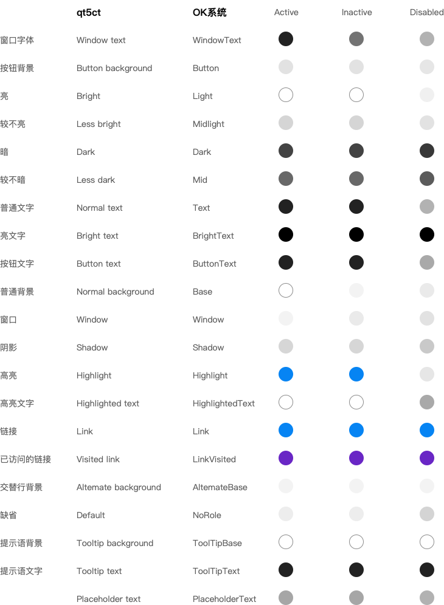
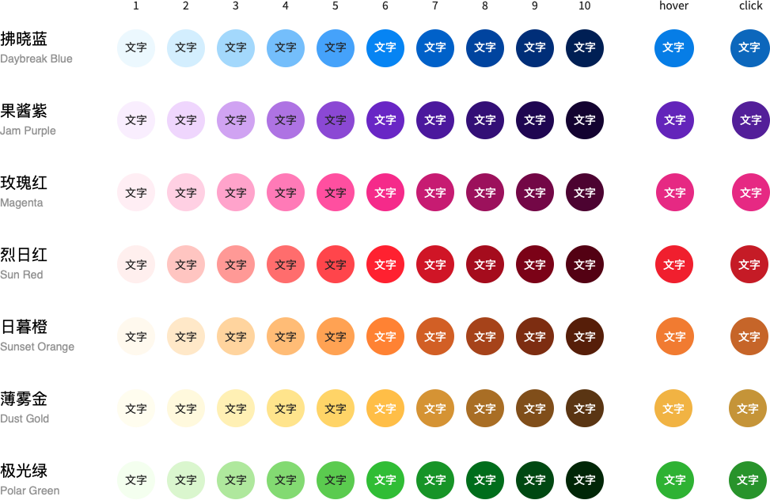
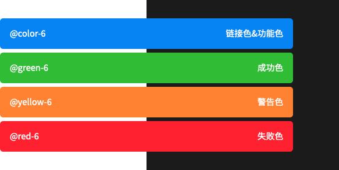
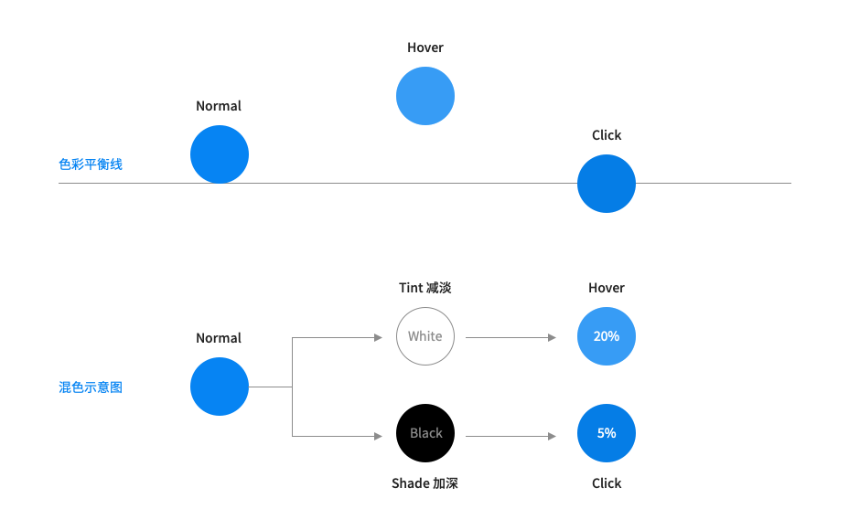
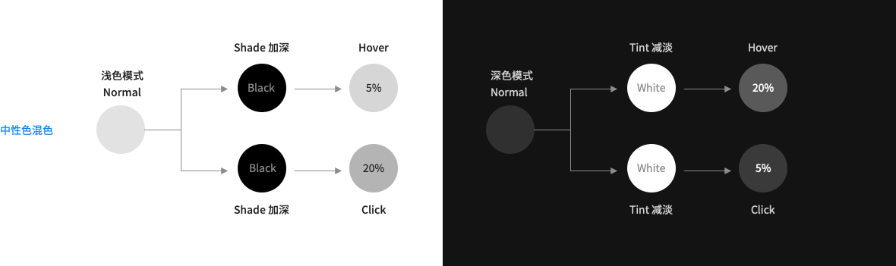

## 系统主题色板
色彩在界面设计中的使用应同时具备品牌识别性以及界面设计功能性。色彩是相当感性的东西，设计中对色彩的运用首要应考虑到品牌层面的表达，另外很重要的一点是色彩的运用应达到信息传递，动作指引，交互反馈，或是强化和凸现某一个元素的目的。任何颜色的选取和使用应该是有意义的。

目前系统常用到的主题颜色（如下图为系统浅色主题色板）：

## 色彩识别
合适的色彩对比为信息传达加分，同时也应放考虑到有颜色识别障碍人群的需求。我们将每种主色衍生出来的颜色进行了打标，在考虑对比颜色的选择时建议两种颜色对应标签数值的差要大于等于 5。（系统默认控件色对应为数字6列）

## 中性色板
中性色包含了黑、白、灰。合理地选择中性色能够令页面信息具备良好的主次关系，助力阅读体验。

## 功能色

## 色彩和交互
设计元素本身由于交互行为会引发一系列细微的视觉变化，而元素本身的颜色变化有时也能很好的实现这一目的。在进行这类设计的同时，建议采取在颜色上添加黑色或者白色并按照 n+5% 的规律递增的方式来实现。以下图为例，当鼠标 hover 某个特定元素，就视为浮起，对应颜色就相应增加白色叠加，相反点击的行为可以理解为按下去，在颜色上就相应的增加黑色的叠加。

