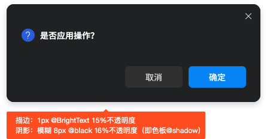

# Layout 常用布局
## 常用布局
布局和导航是产品的骨架，是界面的重要构成模式之一，是作为后续展开页面设计的基础，可以为产品奠定交互和视觉风格。
### 尺寸规则
1、上下结构：顶部 title 区高度为 40px 。

顶部从左自右依次为：logo、应用标题、窗口多联（自定义、更多、最小化、最大化、关闭/退出）。

适用于不需要导航的应用结构。（如看图工具、便签本等）

通常将内容放在一定尺寸（主界面建议少于1000px）内，整个界面排版稳定，不受用户终端显示器影响；上下级的结构符合用户上下浏览的习惯。

2、左右结构：侧边导航宽度的范围计算公式：200+8n 。

侧边导航在界面布局上采用的是左右的结构，一般主导航放置于页面的左侧固定位置，辅助菜单放置于工作区顶部。

适用于需要导航的应用结构。（如文件管理器、控制面板等）

侧边导航的模式层级扩展性强，一、二、三级导航项目可以更为顺畅且具关联性的被展示，同时侧边导航可以固定，使得用户在操作和浏览中可以快速的定位和切换当前位置，有很高的操作效率。

3、过渡结构：上左右——顶部 title 区高度为 40px，侧边导航宽度的范围计算公式：200+8n 。

作为过渡方案的上左右结构：
1.顶部从左自右依次为：logo、应用标题、窗口多联（自定义、更多、最小化、最大化、关闭/退出）。
2.除去顶部的部分采用的是左右的结构，一般主导航放置于页面的左侧固定位置，内容区放置在右侧。

适用于部分未从3.0升级到3.1的应用结构。（如sp2中文管，但侧边栏规则独立于其他应用）

### 透明度+毛玻璃策略
1、上下结构：
	顶部title不透明，内容区可选择不透明或半透明，半透明区的透明度需要符合系统级透明度+毛玻璃效果的标准，并跟随控制面板中特效属性调整。
       

2、左右结构：
       左侧侧边栏区半透明，右侧内容区不透明，半透明区的透明度需要符合系统级透明度+毛玻璃效果的标准，并跟随控制面板中特效属性调整。
       
       

3、过渡结构：
       左侧侧边栏区半透明，顶部title及右侧内容区均不透明，半透明区的透明度需要符合系统级透明度+毛玻璃效果的标准，并跟随控制面板中特效属性调整。
       

### 描边+阴影策略

### 圆角策略

### 分割线策略

### 交互原则
1、导航部分需要在可视化的层面被强调出来；
2、当前项应该在呈现上优先级最高；
3、当导航收起的时候，当前项的样式自动赋予给它的上一个层级；
4、左侧导航栏的收放交互可分为手风琴和全展开的样式，根据需求进行适当的选择。
### 字体放大
1、系统中支持字体和屏幕两种缩放方式，因此设计时需要考虑控件和界面留白；
2、控制面板中字体尺寸标准为默认正文字体的尺寸，标题等可以用em表示，即相对长度单位。

## 系统其他策略
### 界面用色策略
需要遵循主题框架色板标准，采用色板固定函数值的形式（如高亮色采用highlight值），若色板中用色无法满足需求，则采用以色板函数值为基础的颜色代码转换法（lighter&darker），不能自己写死颜色。
1、设计师可增加色板函数值备注或者将图层名称对应的函数值，方便研发和测试查看。
2、尽量采用主题框架标准控件，确保三态一致性，如要定制，需在主题控件的基础上用同样的写法研发。
### 文字相关策略
1、默认字号调整跟随控制面板设置（任务栏、计算器、日历可考虑跟随尺寸放大的策略）；
2、文字省略方案统一为未显示部分省略成“...”；
### 拖拽相关策略
1、调整位置：存在补位动画的组件，需要去掉原位置上的图标，并进行补位（如任务栏、多任务视图）
2、移动：不需要去掉原有图标
3、复制：鼠标处图标上出现“+”（增加）图示
### 全屏策略
在应用非全屏状态下，调整桌面为较小的分辨率时，若应用此时的尺寸小于调整后的分辨率，则应用需自动调整为全屏模式（界面不要超出桌面尺寸范围）
### 贴靠相关策略
1、在应用非全屏状态下，调整桌面为较小的分辨率时，若应用此时的尺寸小于调整后的分辨率，则应用需自动调整为全屏模式（界面不要超出桌面尺寸范围）
2、贴靠策略为圆角显示（即将窗口普通状态放在屏幕区域内显示，系统默认支持1/2和1/4贴靠显示）
