# 主题控件库
## Button 按钮
按钮用于开始一个即时操作。

### 使用场景
标记了一个（或封装一组）操作命令，响应用户点击行为，触发相应的功能。
● 危险：删除/移动/修改权限等危险操作，一般需要二次确认。
● 幽灵：用于背景色比较复杂的地方，常用在首页/产品页等展示场景。
● 禁用：行动点不可用的时候，一般需要文案解释。
● 加载中：用于异步操作等待反馈的时候，也可以避免多次提交。

### 按钮类型
● 主按钮：用于主行动点，一个操作区域只能有一个主按钮。
● 默认按钮：用于没有主次之分的一组行动点，样式同次按钮。
● 虚线按钮：常用于添加操作。
● 线条按钮：比默认按钮次级的按钮。
● 文本按钮：用于最次级的行动点。
● 链接按钮：用于作为外链的行动点。

### 普通按钮
按重要性分为主按钮和次按钮。主次按钮可独立使用，不同的样式用来区别其重要程度。需要强引导用主按钮，切记主按钮在同一操作区域最多出现一次。

按功能分为普通按钮（pushbutton）和工具按钮（toolbutton）。工具按钮多用于工具栏，提供命令或选项。

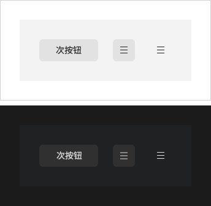

### 图标按钮
当需要在「Button」内嵌入「Icon」时，可以设置「Icon」属性，或者在「Button」内使用「Icon」组件。

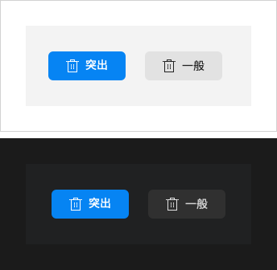

### 按钮状态

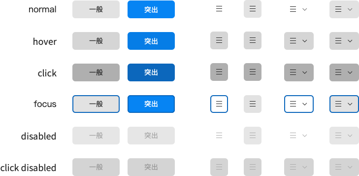

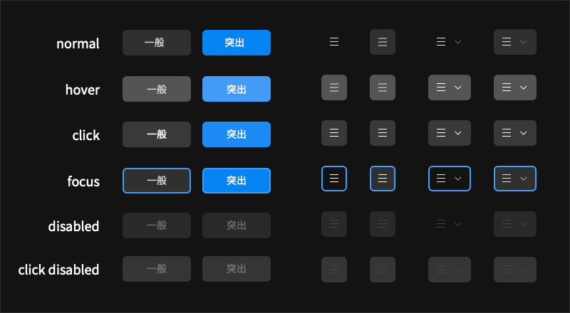

## Tabs 标签页
选项卡切换组件。
### 使用场景
提供平级的区域将大块内容进行收纳和展现，保持界面整洁。
### 标签页类型
● 卡片式页签， 提供可关闭的样式，常用于容器顶部。 
● 分段式页签，由两个或多个分段的线性集合组成，每个分段都充当一个互斥按钮。既可用于容器顶部，也可用于容器内部，是最通用的 Tabs。
● Radio Button（单选按钮），可作为更次级的页签来使用。

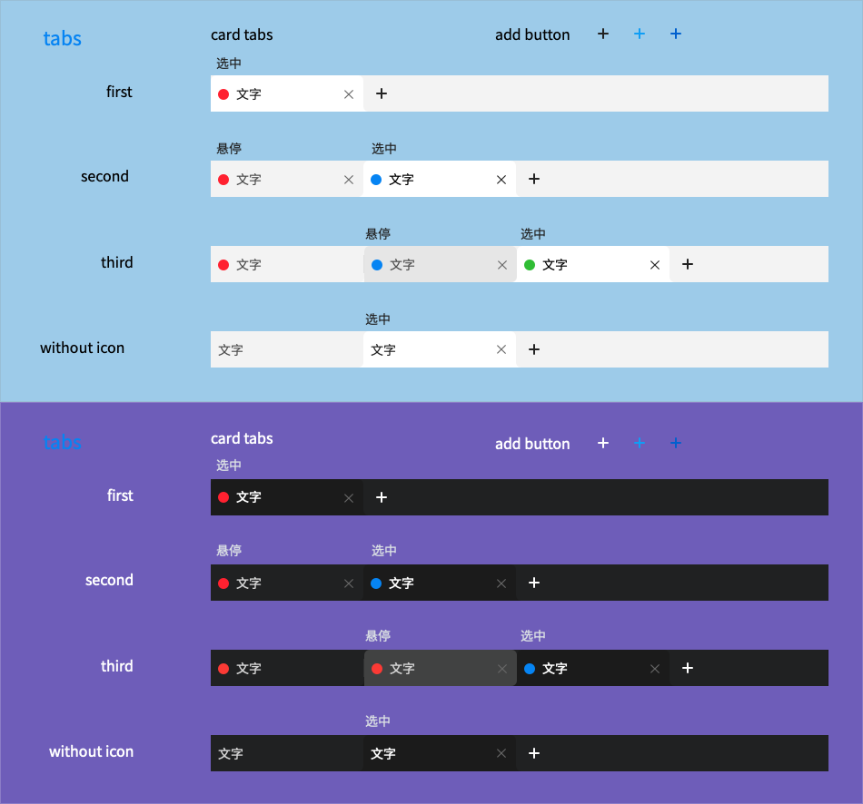

## Input 输入框
通过鼠标或键盘输入内容，是最基础的表单域的包装。
### 使用场景
● 单一输入框：需要用户输入表单域内容时。
● 组合型输入框：提供组合型输入框，带搜索的输入框，还可以进行大小选择。

### 输入框类型
单一输入框

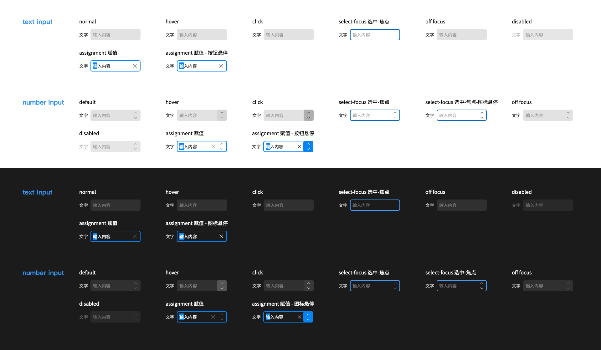

### textedit 文本域

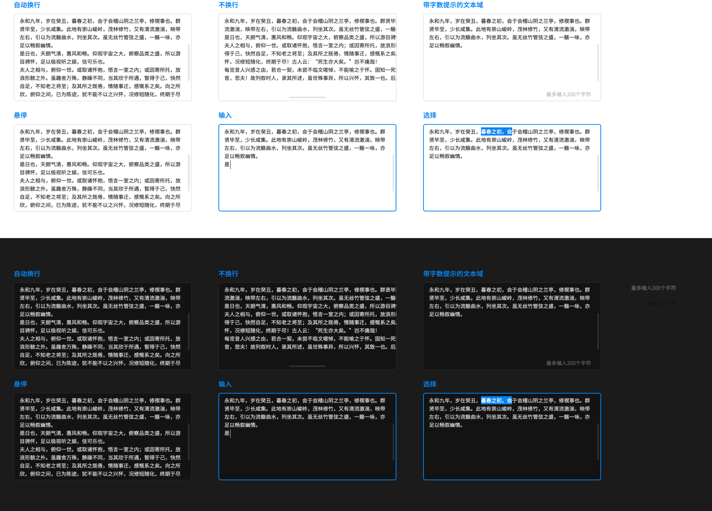

## Select 选择器
### 使用场景

● 弹出一个下拉菜单给用户选择操作，用于代替原生的选择器，或者需要一个更优雅的多选器时。
● 当选项少时（少于 5 项），建议直接将选项平铺，使用 Radio 是更好的选择。

### 选择器状态

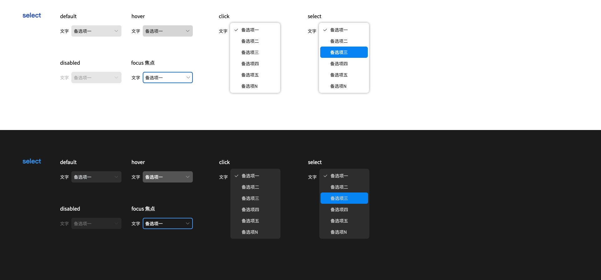

## Slider  滑动输入条

滑动型输入器，展示当前值和可选范围。

### 使用场景
当用户需要在数值区间/自定义区间内进行选择时，可为连续或离散值。可为滑动条添加刻度属性。

### 滑动条类型
● 标准滑动条
● 带输入框的滑动条：和数字输入框组件保持数据同步。
● 带icon的滑动条：滑块左右可以用图标来表达对应的含义。
● 分段式滑动条：不同标记间为包含或并列关系。（SDK扩展）
● 滑动圈：圆形的滑动条。（SDK扩展）

### 带输入框的滚动条
和数字输入框组件保持同步。

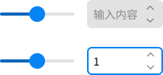

### 带icon的滚动条
滑块左右可以设置图标来表达业务含义。

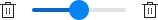

### 分段式滚动条（需搭配有节点的滚动条样式）
按节点关系，分为包含关系和并列关系两种形式。

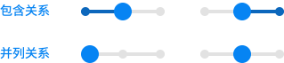

按鼠标响应区，分为非步数、步数、节点三种形式。

