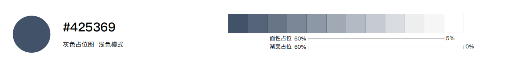
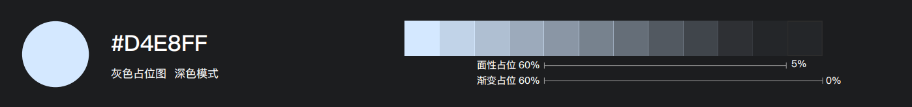
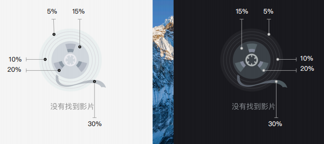
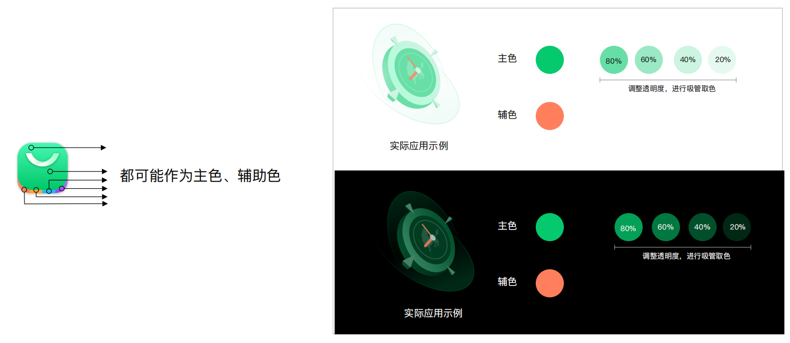
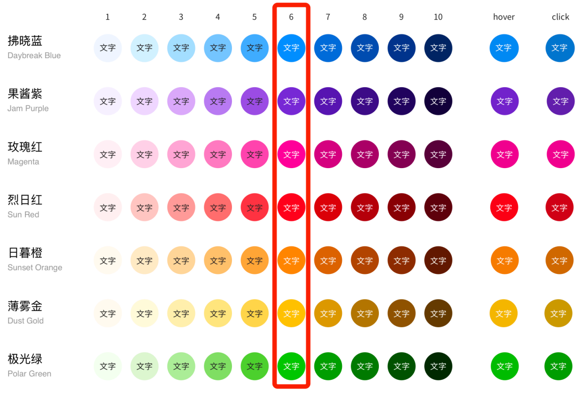
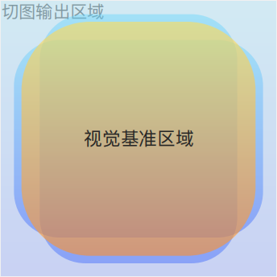
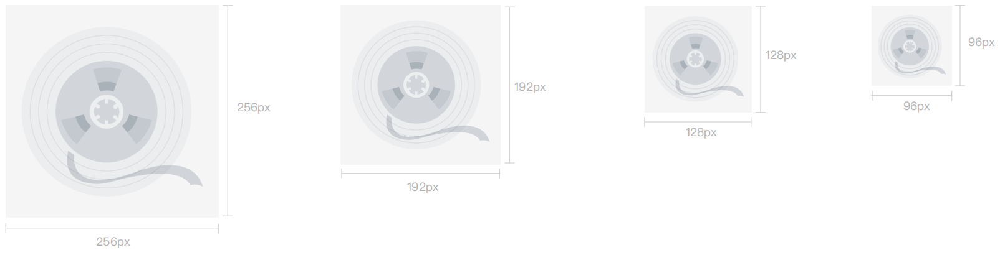
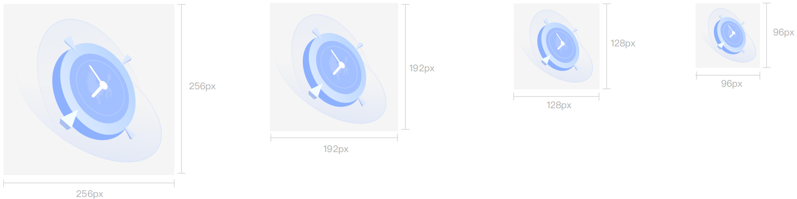

---
title: 占位符设计
description: 
published: true
tags: 
editor: markdown
--- 

                                                                    
# 占位图
该规范旨在明确和标准化操作系统中占位图的绘制方法和使用原则。占位图或缺省图，是以像素为单位构成的图像，具有直观、易于理解等优点。
占位图分为，灰色占位图和彩色占位图。

## 灰色占位图

### 1、适用场景：
- 网络问题：无/弱网络、服务器异常）
- 设备问题：调用异常、无设置）
- 数据问题：空数据、数据无效/异常/不存在
- 权限问题：无权限
- 等待：加载中、加载失败

### 2、用色范围
- 浅色模式下

- 深色模式下

注意：需输出深浅两色占位图。深浅模式下的透明度应保持一致，透明度均为60%；
用色注意事项

## 彩色占位图

### 1、适用场景：
- 应用内页配图
- 启动引导

### 2、用色范围
用色可以根据自己的需求在系统色板或者应用logo规范中取色。
logo中的颜色需作为主色或作为辅助色。例如：

logo颜色为黑白灰时，主色和辅助色可以从系统色板中取色。例如：

## 尺寸（单位：px）
输出大小为256x256、192x192、128x128、96x96，根据窗口大小自行匹配适宜的尺寸。主视觉内容占切图输出区域的85%。

|尺寸	|主视觉区域（规则）	|主视觉区域（不规则，最大范围）|
|---|---|---|
|256x256px|	218x218px|	232px|
|192x192px|	166x166px|	174px|
|128x128px|	110x110px|	116px|
|96x96px|	82x82px|	88px|

效果如下：

