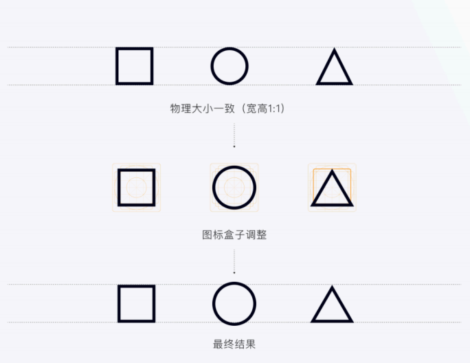
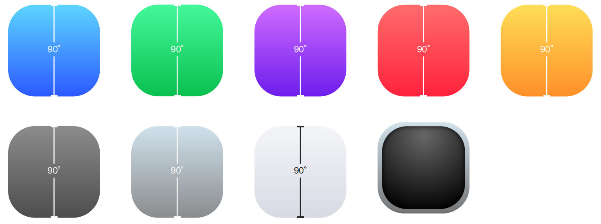
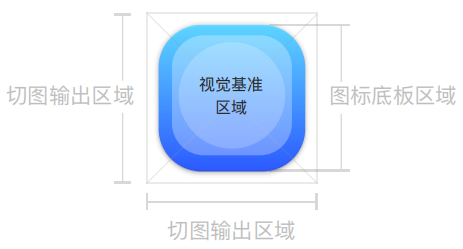
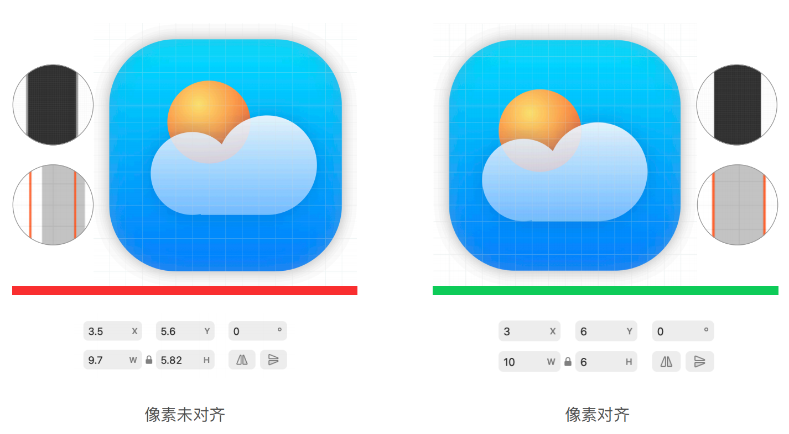

---
title: 图标设计
description: 
published: true
tags: 
editor: markdown
--- 

                                                                    
# 图标设计
## 目的
图标是界面设计中必不可少的组成。通常我们理解图标设计的含义，是将某个概念转换成清晰易读的图形，从而降低用户的理解成本，提升界面的美观度。
为了保障系统中各应用图标的统一性，保证多成员参与的项目保持视觉一致性，塑造品牌调性，特制定本规范文档。

## 设计原则
- 保持简单：创建干净、简单。简单易懂的设计可帮助用户更快地识别你的应用；
- 保持通用：易于访问、易于理解。避免复杂或过于抽象的形式；
- 保持美观：提供美观的设计和可靠的体验。
由于不同图标外轮廓不同，就会导致哪怕在物理⼤⼩上相同的图标（假设都是
24x24），但视觉上可能还是会给⼈⼤⼩不⼀致的感受， 因此我们需要借助前⾯提到的图标盒⼦ 
进⾏约束调整。

### 颜色
颜⾊渐变为90°保持静⽌，规范提供了8种颜⾊渐变，⼀种特殊径向渐变，设计师根据产品定位、⻛格选其⼀即可。

### 大小（单位：px）

 <table>
	<tr >
	    <th rowspan="2">尺寸</th>
	    <th colspan="2">方底板区域</th>
	    <th rowspan="2">圆底板区域</th>
	    <th rowspan="2">阴影</th>
	</tr >
    <tr>
	    <th>大小</th>
	    <th>圆角</th>
	</tr >
    <tr>
	    <th>128 x 128</th>
	    <th>110 x 110</th>
	    <th>32</th>
	    <th>112 x 112</th>
	    <th>#000 30%；X:0 Y:1 模糊:4</th>
	</tr >
    <tr>
	    <th>96 x 96</th>
	    <th>82 x 82</th>
        <th>24</th>
	    <th>84 x 84</th>
        <th>#000 30%；X:0 Y:1 模糊:3</th>
	</tr >
    <tr>
	    <th>64 x 64</th>
	    <th>54 x 54</th>
        <th>16</th>
	    <th>56 x 56</th>
	    <th>#000 30%；X:0 Y:1 模糊:2</th>
	</tr >
    <tr>
	    <th>48 x 48</th>
	    <th>40 x 40</th>
	    <th>12</th>
        <th>42 x 42</th>
	    <th>#000 30%；X:0 Y:0 模糊:1</th>
	</tr >
    <tr>
	    <th>32 x 32</th>
	    <th>26 x 26</th>
	    <th>8</th>
        <th>28 x 28</th>
	    <th>#000 30%；X:0 Y:0 模糊:1</th>
	</tr >
    <tr>
	    <th>24 x 24</th>
	    <th>20 x 20</th>
	    <th>6</th>
        <th>22 x 22</th>
	    <th>#000 30%；X:0 Y:0 模糊:1</th>
	</tr >
    <tr>
	    <th>16 x 16</th>
	    <th>14 x 14</th>
	    <th>4</th>
        <th>14 x 14</th>
	    <th>#000 30%；X:0 Y:0 模糊:1</th>
	</tr >
</table>

尺寸包括：
16x16、24x24、32x32、48x48、64x64、96x96、128x128、256x256，16x16@2x、24x24@2x、32x32@2x、48x48@2x、64x64@2x、96x96@2x、128x128@2x、256x256@2x

### 格式
主题图标由png和svg组成，png为推荐，svg为备选。
图标显示位置
应用图标显示在openkylin中的各个位置
- “开始”菜单
- 任务栏 & 托盘
- 初始屏幕
- 应用窗口标题栏
- 搜索结果
- 通知 & 对话框
- 系统监视器
- 设置

### 图标缩放
| |100%	| 125% | 150% |	200%| 	250%|	300%|	400%|
| --- |--- | --- | --- | --- | --- | --- | ---|
| 关联菜单、托盘、导航 | 16px| 20px | 24px | 32% | 40px | 48px | 64px |
| 标题栏	|24px	|30px	|36px	|48%	|60px	|72px	|96px |
| 任务栏、开始菜单	|32px	|40px	|48px	|64%	|80px	|96px	|256px|

### 建议
在图标绘制中，需尽量避免坐标位置xy或宽⾼参数出现⼩数点，以此保证最终导出的图标是清晰的。

