---
title: 对话框
description: 
published: true
tags: 
editor: markdown
---                                                                                     

# 窗口对话框
对话框的设计在很大程度上取决于其用途（提供选项、提问、提供信息或反馈）、类型（模式或非模式的）和用户交互（必需、可选响应或确认），而其用法主要取决于其上下文（用户或程序启动）、用户操作的概率和显示频率。

## 对话框概念
对话框可以是模态的或非模态的。模态对话框会阻止用户与应用程序的其他部分进行交互，直到对话框被关闭。而非模态对话框则允许用户在对话框打开的同时继续与应用程序的其他部分进行交互。

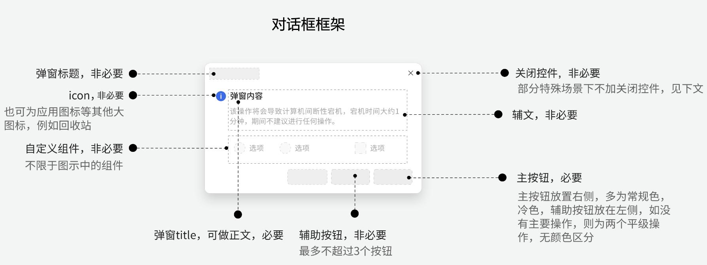

## 通用交互规则
### 1、模态蒙层
- 一般情况下，模态弹窗需要蒙层：特别需要用户聚焦于弹窗内的操作时。
- 某些情况下，弹窗弹出时不需要模态蒙层：当弹窗内容相对简单，不需要用户进行太多的输入或选择时，例如，简单的确认消息、提示消息等；当用户在进行任务时需要参考背景窗口的资源时，不需要使用模态蒙层。
- 一般情况下，桌面弹窗不需要蒙层，除非有灾难性结果发生。

### 2、关闭按钮
必要情况下，模态弹窗可以无关闭按钮，例如：需要用户在一定时间内浏览/处理的信息弹窗、进度条弹窗等，一般情况下，此类模态弹窗也不允许拖拽，需要模态蒙层。
- 关闭按钮：仅关闭，不执行任何改动；
- 关闭方式：点击关闭按钮/点击确定、取消按钮/键盘Esc；

### 3、最小化
当模态弹窗被设计为不可拖拽、必要情况下甚至无关闭按钮时，父窗口可以进行最小化、最大化操作（应用窗口），并且模态弹窗会随之一起最小化。
非模态弹窗需要最小化的场景有：弹窗显示某些进度或状态信息时，用户可最小化弹窗去处理其他任务。弹窗内容可以让用户稍后处理，用户可最小化弹窗。

### 4、功能按钮
一般情况下，【确定】为主要操作，【取消】为次要操作，当【取消】所对应的操作为主要操作时，两个按钮为平级按钮，无颜色区分。

### 5、弹窗位置
- 居中显示，通常在可视范围内处于合理位置即可。（可视范围要考虑到任务栏高度，浏览器内考虑地址栏等区域，才能最终确定）。
- 固定显示位置，例如固定在工具栏、标题栏下方，例如文件打开对话框和文件保存对话框通常会出现在屏幕的中央或者特定的位置上。对话框的具体位置仍可以调整以适应特定的设计需求。

## 对话框分类
### 1、问题对话框（question dialog）
确认已经触发的动作，并询问是否进行此操作，常见于弹窗的二次确认。
文案建议：【是否执行操作＋风险＋建议（非必要）】。对应的按钮使用具体动词或词组，而非直接使用 【确认】、【是】、【否】等，一般具体动作按钮与【取消】按钮成对出现。

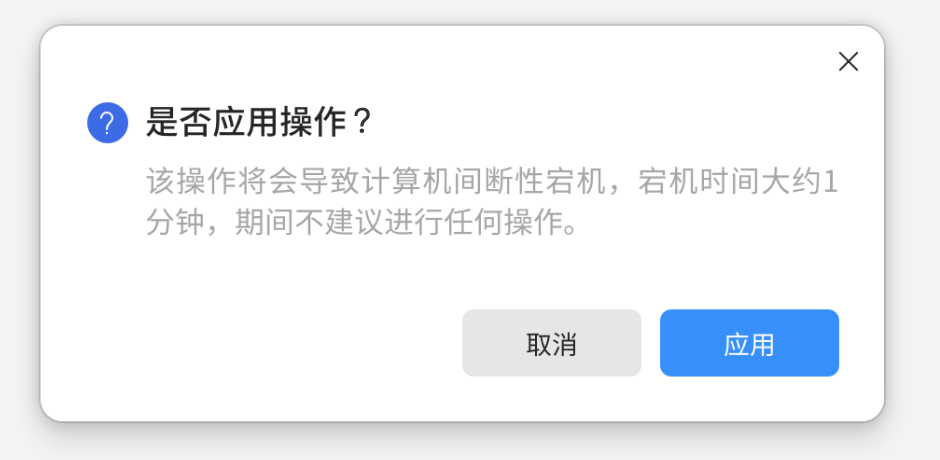

### 2、提示对话框（Info/Warning/Error/About dialog)
用户进行操作时触发，陈述当前情况，直到用户确认知晓后才可关闭。文案建议：【情況陈述＋相关操作】。对应的按钮使用一般为【确定】/【操作按钮】和【取消】，或者仅 【确定】、【好的】，或【其他操作按钮】。

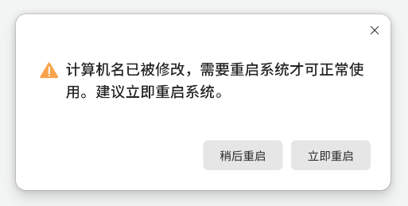

### 3、内容对话框（input dialog）
当用户进行操作时会被触发，中断用户操作，提示用户进行设置等操作的对话框。

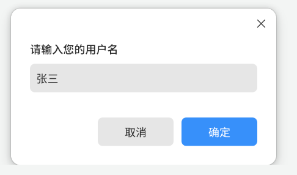

可自定义配置不同内容，并增加一些简易配置，如表单，单选，复选框。

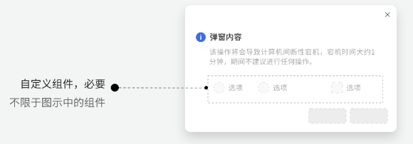

### 4、自定义对话框
相比内容对话框，此类对话框可承载一定量表单配置，也多称为功能对话框、属性对话框等。

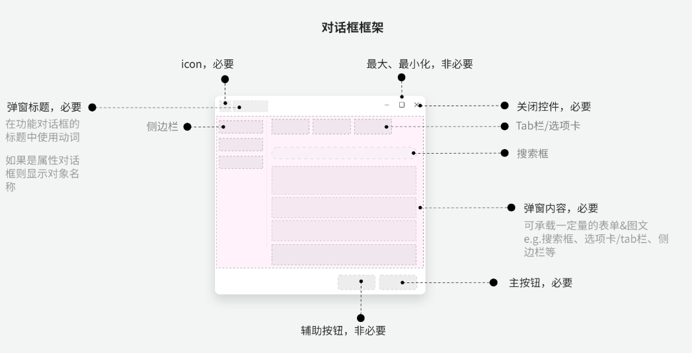

#### 1-4类对话框使用场景
控制单一功能，例如：打印配置、插入对象、拼写检查、属性、进度等。通常从界面中的菜单中直接打开。

#### 正确使用
原则1：放置主流交互以外的功能。
原则2：适合整理单一主题或功能，减少用户寻找的麻烦。
原则3：控制高级选项或学习基础信息，紧凑、功能强大、快速、使用流畅，具有清晰的自我解释性。

### 5、进度对话框（Process Dialog）

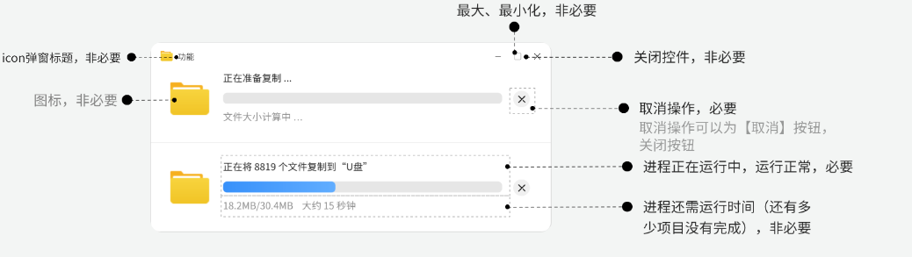

### 6、倒计时对话框

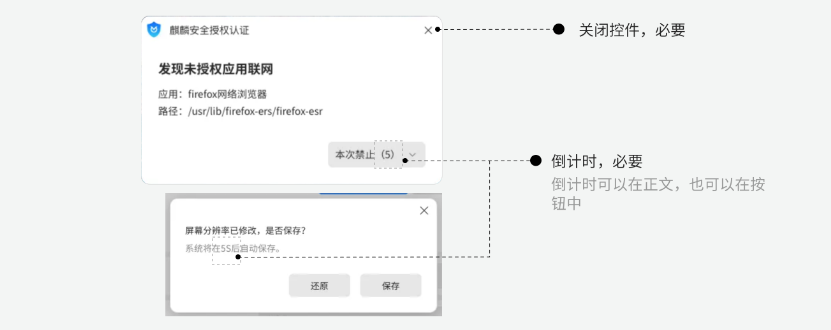

### 7、通知对话框

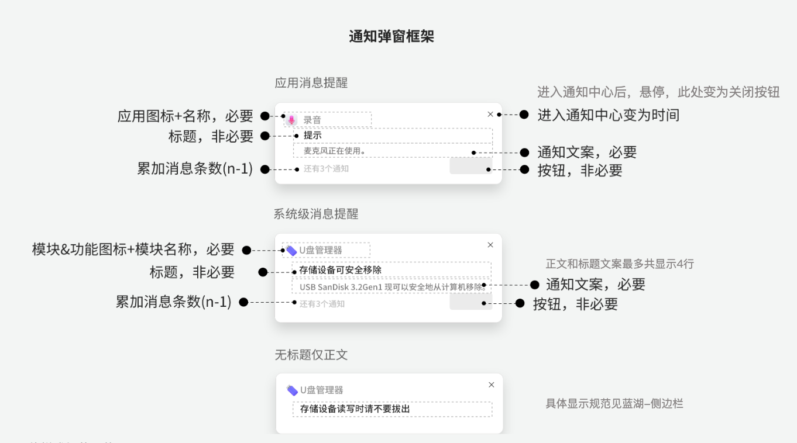

- 一般情况下，停留6s自动移除。
- 应用通知可导航用户至详细信息页面（点击）。
- 鼠标移入后，弹窗禁止自动移除。
-	同一事件短时间内收到多条通知，每次均显示最新的一条，同一应用的多条消息进行折叠 (Gif 1)。
-	并列信息条数：暂无限制，同类消息折叠，其他情况向下罗列 (Gif 2)。
-	通知弹窗不会超时自动关闭，即通知永远不会过期，均收入侧边栏中（符合通知协议中的 Expiration Timeout 0:通知永不过期）。

### 8、气球提示对话框

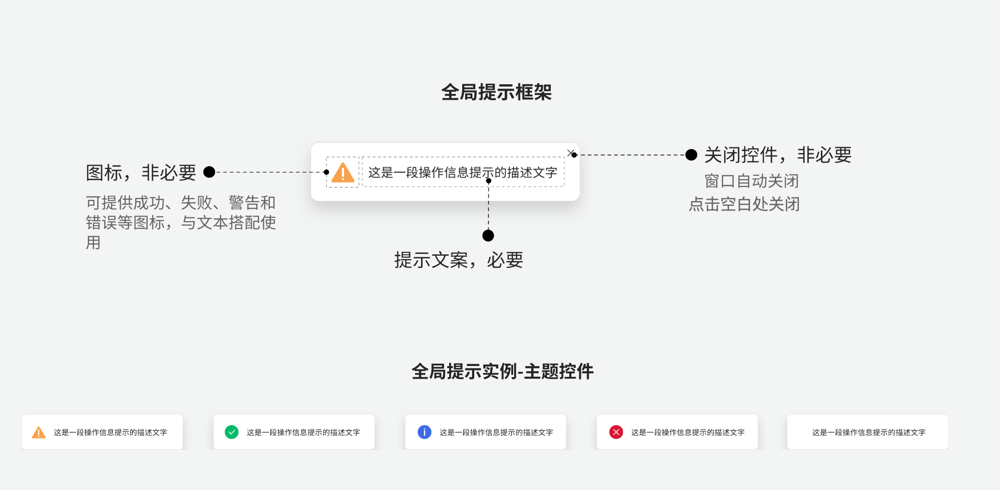

-	一般在界面顶部、底部或居中显示，约3秒后自动关闭。
-	用来显示【成功、警告、消息、错误】类的操作反馈。

### 9、气泡对话框

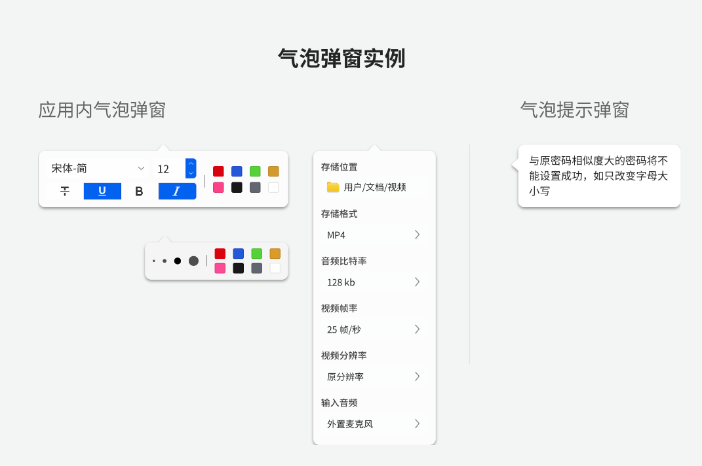

使用场景有：将工具显示在弹出窗口以帮助简化界面。当界面上有帮助或提示图标时，悬浮或点击显示。
正确使用：气泡显示少量信息或功能，避免使用太大的气泡窗口，如果需要，最好更改控件的选择。

### 10、颜色对话框
颜色选择器是一种允许用户选择色块或输入颜色色值的文本区域

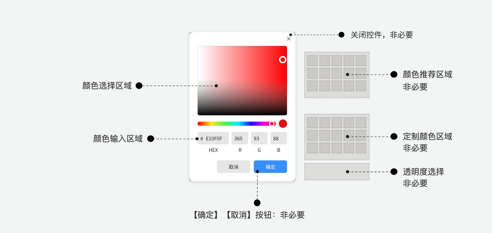
 
