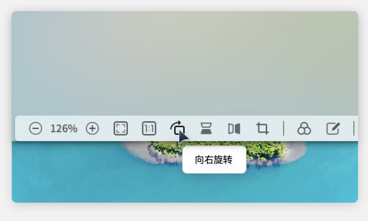
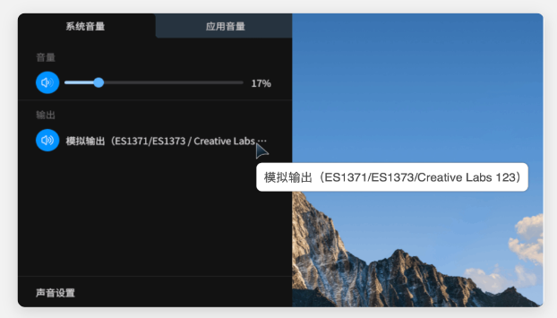
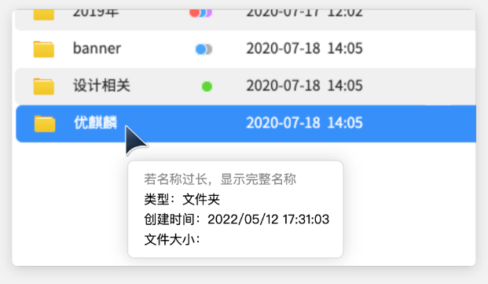
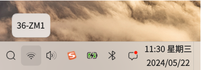
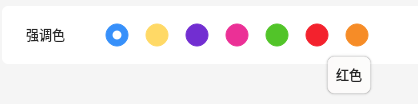
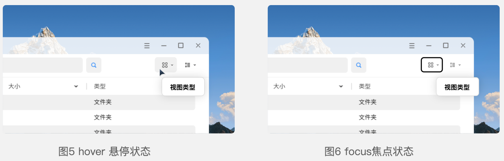
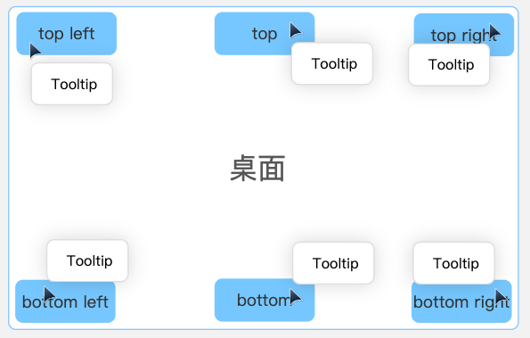
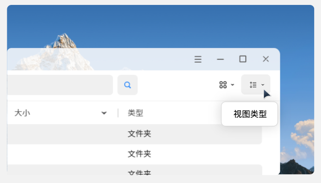

---
title: 工具提示
description: 
published: true
tags: 
editor: markdown
---       

                                                                    
# 工具提示和信息提示
为了满足标准化的工具提示弹窗交互，确保用户体验的一致性，降低学习成本，并向windows、ma、linux等标准的工具提示弹窗规范靠拢，特制定本文档。

## 使用情况
| 场景 | 图示 |
| --- | --- |
| 工具提示   无文本标签的控件 |  |	 
| 全名信息提示   当名称被截断或不完全可见时，显示项的全名 | 	  |
| 详细信息提示   显示有关对象的详细信息 |  |	 
| 状态信息提示   显示托盘区域图标的状态信息 |  |	 
| 替换文字信息提示   描述辅助功能，用于视力障碍且可能使用屏幕阅读器的用户 |  |	 

## 交互策略
鼠标操作时，工具提示基于鼠标悬停显示（hover）
键盘操作时，工具提示基于焦点聚焦显示（focus）

 

### 1、显示与隐藏策略：
- Hover显示：鼠标指针悬停时，在0.1s内显示视觉反馈Hover效果；
- Tooltip显示：Hover显示后，等待0.3-0.5s，如期间光标在目标区域内停留未移走，在0.1s内显示 Tooltip内容；
- Tooltip消失：直到鼠标指针离开目标区域0.5s,Tooltip消失；最长显示时间10秒后自动关闭 (Tooltip100个字符以内)

### 2、提示内容原则：
- 不重复UI中已有文本（不包含交互式控件）；
- 文本简洁易懂（具体参考界面用语）；
- 可以添加图片；
- 字符不超过100，即中文字符不超过50个，原因：超过100个字符后，每增加一个字符多0.04s显示时间，影响交互体验；
- 中文字符超过25个时换行；
- 英文字符超过50个时换行，提示窗口自适应变化，保持间距不变。
  
 

### 3、显示定位：
1)	通常情况下，提示跟随鼠标并出现在指针头部或者尾部；并且不受应用窗口的约束；

 

2)	工具提示需要根据具体场景调整显示位置，使提示不被切割；
在屏幕边缘时，识别显示位置，不遮挡&切割工具提示。

 

3)	必要情况下，工具提示需要定位位置，以防遮挡用户即将交互的内容，需保持指针和提示的关联性足够清楚；
任务栏的信息提示固定居中显示，并保留6px的距离。

 

4) 在画板等工具中，追踪型工具提示显示当前交互元素的坐标值。比如截图工具。

