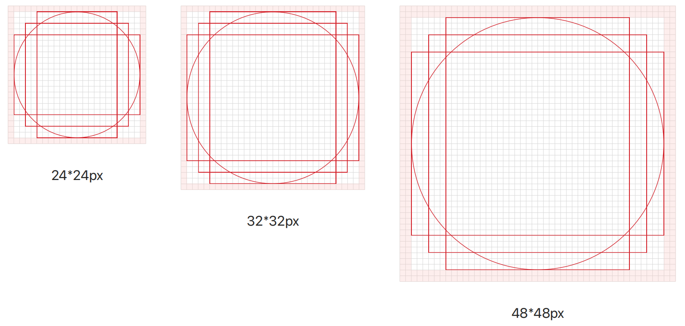
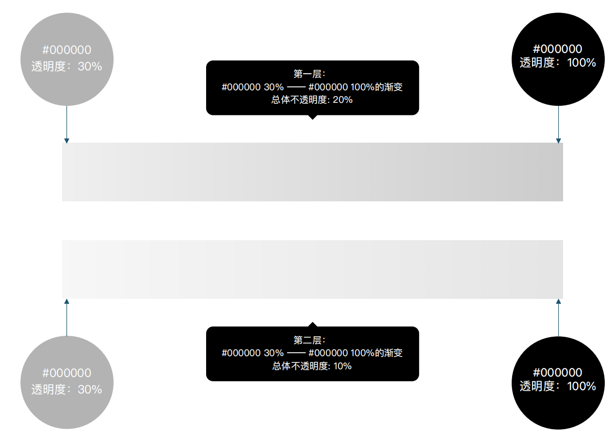

---
title: 指针
description: 
published: true
tags: 
editor: markdown
---     

# 指针
指针是一张小图片，其在屏幕上的位置由鼠标、笔或者手指控制。 当用户移动鼠标时，系统会相应地移动指针。 指针具有各种形状，用于指示其当前行为。

### 指针形状
常见的指针形状和用法。
| 形状|	名称|	场景覆|
| :---:|---|---|
|  | 	正常选择 |	常规：选择内容和界面元素并与之交互   增加：各应用窗口、项目的选中、拖放；按钮点击（包括）|
|  |	文本选择	|在组件中接收、指示水平文本输入
|  |	加载 |	阻止应用与用户的交互操作（应用用沙漏光标阻止用户操作，让其等待。）|
|  |	对角线调整大小 1	| 西北-东南方向调整顶层窗口大小|
|  |	对角线调整大小 2	| 东北-西南方向调整顶层窗口大小|
|  |	水平调整大小 |	水平调整顶层窗口大小| 
|  |	垂直调整大小	| 垂直调整顶层窗口大小 |
|  |	移动	|在图形处理过程中，帮助用户精准定位，移动处理图形 |
|  |	不可用	| 拖动的内容不能放在特定区域、组件、界面元素上，放置目标无效|
|  | 	链接选择|	指向网页、文档等其他项目的URL链接，只用作悬停状态，此处不包括文字按钮|
|  | 	帮助	| 标示帮助信息组件的存在|
|  | 	后台工作 |	用户在与应用程序进行交互操作，并且没有其他可视反馈指出该操作未完成时，用来指示应用在后台执行 |
|  |	精准选择	| 精准的选择点、矩形、圆圈、箭头、直线区域，具体使用场景在截图、看图应用中|

## 比列和尺寸（单位：px）
光标有三个尺⼨，分别为：24*24px、32*32px、48*48px。
为保持光标的视觉平衡，特制定右图轮廓线，设计时需严格遵守此规范。

注意事项：除⾮有特殊必要，在设计中应避免将图形设计延展到出⾎位内；对于不同轮廓线的图标，设置了基本的⽐例尺⼨，有助于把握不同图标之间的视觉⼤⼩平衡。如有需要，可以将图形适当延伸出/缩进⾄轮廓线；图标在视觉上应保持重⼼⼀致，不要完全使⽤软件内⾃带的绝对居中功能，有时需要通过⼿动调整来达到视觉上的居中。

## 描边&阴影

<table>
    <tr>
        <th>尺寸</th>
        <th>描边</th>
        <th>描边颜色</th>
        <th>阴影</th>
    </tr>
    <tr>
        <th>24 x 24px</th>
        <th>1px</th>
        <th>#FFFFFF，透明度100%</th>
        <th rowspan="3">#000(30%)至#000(100%)渐变，整体透明度20%。</th>
    </tr>
    <tr>
        <th>32 x 32px</th>
        <th>1px</th>
        <th>#FFFFFF，透明度100%</th>
    </tr>
    <tr>
        <th>48 x 48px</th>
        <th>2px</th>
        <th>#FFFFFF，透明度100%</th>
    </tr>
</table>

