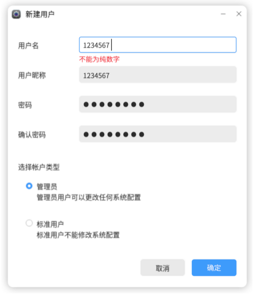
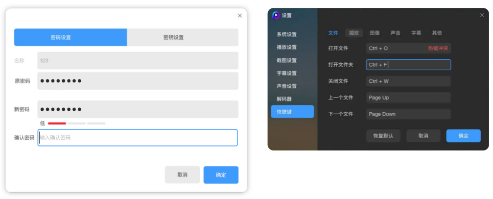
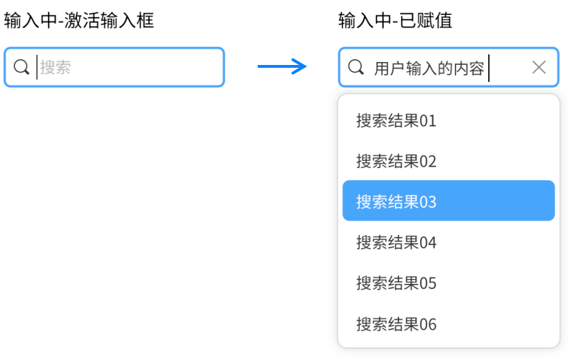

---
title: 数据输入
description: 
published: true
tags: 
editor: markdown
--- 

                                                                    
# 数据输入
数据输入是获取对象信息的重要交互方式，用户会频繁的增加、修改或删除信息。多种多样的文本录入和选择录入方式帮助用户更加清晰和高效的完成这项体验。

数据输入控件包括：
- 输入框
- 文本域
- 搜索
- 选择录入：单选、复选、开关、列表、滑块

## 输入框
### 1、新建表单或者登录
操作前：默认激活第一个输入框，光标放置提示语的左侧。下一步操作按钮置灰。
 

操作中：完成第一次内容变动操作后，下一步操作按钮激活。

操作后：输入完毕，执行操作。

### 2、修改表单
操作前：默认激活首个输入框。显示原内容，光标放置在原内容最右侧。下一步操作按钮激活。

操作中/后：完成内容修改，执行操作。
 

### 3、报错
1) 错误被激活：输入框激活，原内容保留，光标放置在原内容右侧。报错信息位置，放置在每个输入框下面，与输入框左对齐。

改正错误：进行修改时，当首次内容变动，报错信息消失。
 

2) 报错状态：
报错信息出现的位置有两种方式：放置每个输入框下面，与输入框左对齐。

放置整体表单列表的下面，与表单左对齐。

3)	校验方式
即时校验：每完成一个输入框的内容输入，焦点离开该输入框，进行校验。
- 需要立即校验的输入项，例如密码强度检验、快捷键设置；
- 表单中没有结束操作按钮，需使用这种方式；
- 除此之外，其余不推荐使用。因为这种校验会主动干扰用户的输入进程。

 

最终校验
- 输入表单的过程中，不进行校验。最后点击下一步操作按钮时，进行校验；
- 多项表单的报错顺序，按照场景逻辑顺序依次报错，每次操作只报一项，报错项是必填项的第一项。

4)	报错内容
内容失效：格式为“名称+错误信息”，结尾处不加标点符号。
- 内容重复被占用，例如“名称已被使用”；
- 内容无法被数据库识别。例如“IP地址无效”、“账号未注册”。

内容格式错误
- 简单报错，且用户知道如何改正，就简单提示，不提示格式要求。例如提示名称已被使用、账号未注册、IP地址无效等等；
- 报错格式要求复杂，需要提示改正方法，让用户知道怎么改正。直接列出输入框格式的要求，“格式要求”，结尾处不添加标点符号；
- 如果基于安全性考虑，不想提示格式要求，可以只使用“错误状态”；
- 如果有明确的禁忌性要求，可以使用“错误状态+禁忌”。
无内容：“名称+不能为空”，结尾处不加标点符号。

## 文本域
1、操作前：无数据默认状态，无光标，输入框未激活。提示语需结合场景决定；

2、操作中：激活输入框，输入态、选择内容、内容过多进行自动换行；

3、操作后：输入完成态。

## 搜索
### 1、搜索流程
操作前：搜索框为标准态（图标+提示语+输入框），无光标，输入框未激活。提示语结合场景决定。

操作中：激活输入框。
分两种状态：第一种是无下拉列表。第二种是有下拉列表，内容为历史记录或者系统推荐词。数据输入过程中，搜索结果推荐通过下拉列表展示，或不提供搜索结果推荐，根据场景自行决定。

操作后：输入完成，恢复非焦点状态。若再次激活该搜索框，则会显示之前的搜索结果推荐。

### 2、搜索规则
搜索内容显示规则：
- 内容超出限制，输入框的高度不变。当输入词超过一行以后，输入信息会自动前滚；
- 查找输入的内容，鼠标或键盘方向键左右键移动光标，遵循麒麟键盘导航与交互规范；
- 修改文字内容，选择该内容的区域，进行修改。
关键词匹配规则：
- 使用自动建议机制，根据用户输入的字符来预测要查询的内容，帮助用户找到合适的查询关键词，更好地完成查询；
- 建议项要少于10个（并且没有滚动条），避免用户因为巨大的信息量而不知所措；
- 如果候选词包含在多个分类中，需要进行分类展示。

结果显示规则：
输入过程匹配：输入过程中进行实时匹配，同时更新页面信息。

输入完成匹配：在输入完后，点击「搜索」按钮或回车进行搜索，展示结果。省去对输入时实时分析过程，适用于对搜索功能要求不高的情况。

## 选择录入
1、单选框：单选按钮允许用户从多个选项中选择一个选项。
单选框的所有选项默认可见，方便用户在⽐较中选择，因此选项不宜过多。
注意：单选框（Radio Button）⼀定多于 2 个，⼀般少于 5 个。

2、复选框：复选框用于在⼀组可选项中进行多项选择时。
注意：
- 复选框（Checkbox）⼀般⽤于状态标记，需要和提交操作配合；
- 单个复选框可以表示两种状态之间的切。

3、开关：用于切换单个选项的状态。当用户切换「开关」按钮将直接触发状态改变。

4、选择列表：（通常称为下拉菜单）允许⽤户从列表中选择⼀个选项或多个选项，为⽤户在选项的数量上提供了更多的灵活性。
注意：
- 当选项多于 5 项时使用；
- 列表选项按照逻辑排序，并尽量让内容显示完整。

5、滑块选择：可以在连续或间断的区间内，通过滑动锚点来选择⼀个合适的数值。这种交互特性使得它在设置诸如⾳量，亮度，⾊彩饱和度等需要反映强度等级的选项时是⼀种极好的选择。

滑块类型
a.	标准滑动条（主题框架默认）

b.	带输入框的滑动条：和数字输入框组件保持数据同步。（主题框架默认）

c.	带icon的滑动条：滑块左右可以用图标来表达对应的含义。

d.	分段式滑动条：不同标记间为包含或并列关系。

e.	滑动圈：圆形的滑动条。

6、⽇期选择器：为用户提供了一种可视化方式去浏览和选择⼀个日期或者日期范围。

