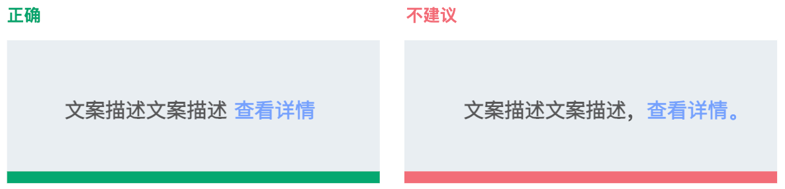

---
title: 界面用语
description: 
published: true
tags: 
editor: markdown
---            

                                                                    
# 界面用语
## 界面用语设计总原则
- 用简单、清晰的语言为用户减少歧义；
- UI语言可以轻易翻译为其他语言；
- 创建与用户日常生活相关的内容。

## 界面用语写作原则
### 原则1：精简语句，尽可能避免使用冗长的介绍性说明。
冗余文本不仅占用了宝贵的屏幕空间，而且削弱了你试图传达的重要想法或操作的有效性。 这也是在浪费读者的时间，在扫描成为常态的情况下更是如此。

### 原则2：简单、直接的语言。
忽略无用词语，选较为简短和直接的用语。

### 原则3：明确用户称呼，以第一人称（我、我的）称呼用户，或者以第二人称（你、你的、您、您的）称呼用户。
强调用户对操作的所有权，从用户角度来看，是自身行为的延伸，是定制化；使用场景：用户创建的文件内容；带有责任的条款确认。

### 原则4：目标引导，说明操作的意图，促使用户执行。

### 原则5：前后表述一致，在同一界面中，对同一对像的描述要前后一致。

### 原则6：英文标题、标签、菜单项首字母大写，遵循英文句式中的规范。
- 导航每个单词首字母大写、应用名称每个单词首字母大写；
- 工具提示单词首字母大写；
- 下拉选项中的英文选项首字母大写；
- 单&多选项首字母大写；
- 输入框标题首字母大写；
- 表格内项目的首字母大写；
- 特殊名词如必须小写则不受此规则影响，例如 eDP-1；特殊名词如产品名称等需要全部大写的单词不受该规则影响，例如 IBM。

## 标点符号使用原则
### 1、句号
- 用户界面中，文案为界面标题、副标题、词组、按钮、短句、单句时，末尾不加句号。有两个或更多句子的情况下加句号；
  

- 带项目符号的文本，如果一条项目内容≥2 句，文本末尾都加句号；如果项目文本是短语、单句或短句，则不加句号；
- 对于文本信息量较大的段落型文本（如协议条款、使用需知、免责声明等），末尾需添加句号；
- 当句末为文字链接时，应在文字链前添加句号，如该句属于上述中的【末尾不使用句号】场景，则在文字链接前添加空格（半角）；

- 以下组件中的文本无需使用句号。

### 2、逗号
表示句子内部的一般性停顿，在用户界面中避免出现一逗到底的文案，应用句号切分语意，帮助用户梳理逻辑。在长句子中，利用“这”、“其”等代词，合理切分句子之间的逻辑。

### 3、叹号
系统应保持平等友善的语气，而叹号具有强烈的感情色彩，表示感叹语气、强烈的祈使语气和反问语气，易给用户造成紧张情绪，因此需谨慎使用。可以使用的场景：操作成功、祝贺、欢迎等。

### 4、问号
问号用于句子末尾，表示疑问语气（包括反问、设问等疑问类型）。使用问号主要根据语段前后有较大停顿、带有疑问语气和语调，并不取决于句子的长短，适用于所有类型的文本，如对话框、气泡等弹窗中的询问类语句。

### 5、引号
- 在功能描述文案中，引用其他功能、应用的名称时，加引号；
- 在功能描述文案中，引用设备名称时，加引号；
- 在功能描述文案中，引用磁盘名称、系统版本号时，加引号。

### 6、省略号
- 在自适应方案中，文本超过最大长度时，省略部分文本用（…）底部对齐的省略号，一般场景：按钮、导航栏、工具栏等；
- 表示操作正在进行中，需要等待片刻，可以使用省略号，一般场景：上传... 查找... 更新... 安装... 启动...

### 7、冒号
- 冒号用于需要解释的词语后或者引出详细说明；
- 冒号用于“例如、证明、如下、说、想、是、指出”等词语之后，以提示下文；
- 以下情况不使用冒号。

### 8、顿号
用户界面文案中，顿号使用在2个及以上并列成分之间的短暂停顿，例如：同类的单字、词语或短句。
注意：英文中没有顿号，常用逗号来表示并列词语的停顿。

### 9、连接号
- 使用短连接号（-）来表达范围，例如插图编号、阿拉伯数字年月日、时间、电话号码，产品的名称和型号，复合名词中的连接作用；
- 在严谨的操作系统中，句尾避免使用波浪线（～），编程语言除外，例如：可以使用波浪线切换到家目录[root@xry local]# cd～。

### 10、空格
- 中文和英文单词间需要增加空格（半角空格）；
- 中文与数字之间要增加空格（半角空格），除外：年月日之间不需要增加空格；
- 数字与英文&英文单位之间需要增加空格（半角空格）， 除外：度℃、百分比%、货币符号¥$与数字之间；
- 对于专有名词中如不含空格，需遵守官方使用格式，无需使用空格；

- 中文链接与文字之间增加空格（半角空格）；
- 中英文组合的词语，词语内部不加空格；

- 「/」前后字符均不加空格，但特殊情况下为了排版效果可以适当增加空格（半角空格），例如导航栏；「/」用在路径中时，不加空格。

 

### 11、中英文混合书写下的标点使用
- 中文句子内夹用英文句子时，用中文引号包裹引用该英文句子。如果夹用的英文句子本身带有英文标点，保留其英文标点。句末以中文标点结尾；

- 括号内为中文时，使用全角括号，括号内全部为英文时，使用半角括号，并在括号前后各空一个半角空格，内部英文无需空格。括号内中英混合时建议使用全角括号。

## 对齐方式
中文&英文居左对齐，按照从左到右的阅读顺序，段落文字对端对齐。

数字&小数点对齐，数字通常采用右对齐或者小数点对齐，这样便于对个、十、百、千位上的数字进行对比。

