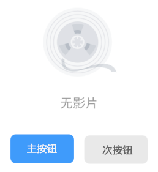
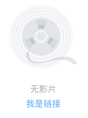
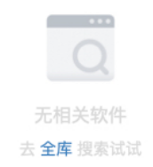
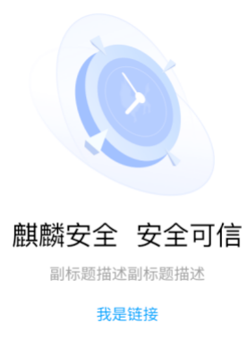

---
title: 空状态
description: 
published: true
tags: 
editor: markdown
---              

                                                                    
# 空状态
旨在明确和标准化操作系统中空状态的使用原则，是我们与产品进行交互时“无东西”可显示的状态下，它的核心并不在于“空”，通过显示各种不同的内容来增强用户体验。因此，它是改善用户体验的一种方式，且可以引导并鼓励用户与我们所设计的产品进行交互。

## 主要目的：
1、空状态应给予提示，帮助让用户了解空状态原因，避免产生误解与迷失；
2、给予用户推荐操作提示，帮助用户摆脱空状态。

## 设计原则：
1、明确，通过使用清晰明了的语言、插画等形式告知用户空状态的具体原因。
2、提供邀请，提供帮助文案、建议操作等解决方案，表明在下一个界面可以做什么，引导用户进行操作。

## 初始无结果
### 1、纯文案。只在“文件管理”使用。

### 2、占位图 + 无结果说明
根据场景的需要，判断是否加上按钮或者链接。（组合型）

### 3、占位图 + 无结果说明 + 按钮
主按钮：默认统一选择主按钮，强化引导作用。
次按钮：需弱化按钮引导作用，或多按钮的场景使用。

### 4、占位图 + 无结果说明 + 链接

 

使用按钮还是链接的规则：
- 用户的动作会对当前场景产生影响，用按钮。
用户的动作影响到了当前场景的前后端，导致产生了新的变化，例如：创建内容、添加内容、导入内容等。这些情况下使用按钮。这样做是为了让醒目的按钮提醒用户要谨慎，放在页面上的按钮会督促用户自己迅速做决定。

- 用户的动作不会对当前场景产生影响，用文字链接。
作为页面跳转或锚点定位的触点。当用户点击后仅是场景跳转，不会对当前场景的前后端产生改变。例如：查看信息、跳转新场景。

## 主动操作无结果
主要场景是用户在进行搜索时无结果状态。
占位图 + 无结果说明 + 帮助

## 启动引导
启动引导，需要进⾏帮助说明和推荐操作，可以使⽤它，能够引导新⽤户上⼿。
占位图 + 主标题 + 副标题 + 按钮或链接

