---
title: 触控&触摸手势
description: 
published: true
tags: 
editor: markdown
---                                                                    

# 触控&触摸手势

为了保障标准化触控板&触摸屏手势体验，保障跨平台应用手势体验一致性、生态系统互通性、减少用户误触的几率、提高开发效率、确保品牌的一致性，特制定本规范文档。

## 基本手势
|   |图示	 |功能描述 |
|  --- | --- | --- |
| 单击	|  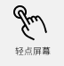 | 手指轻点触控板&触摸屏触发功能，例如：打开应用、选择对象、打开菜单栏、执行按钮命令等 规则：快速点击，时间小于等于600ms，松开后，执行点击行为 |
| 双指点击 | 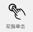 | 双指轻点触控板&触摸屏触发功能，例如：打开右键菜单 |
| 双击 | 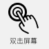 | 手指快速点击两次触控板&触摸屏触发功能，例如：打开桌面应用、文件&文件夹、选择文字等 |
| 长按 | 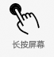 | 手指长按某个元素触发功能，例如：弹出菜单、右键菜单、多选、选择文字等   规则：按下，持续时间大于等于600ms，松开后，执行长按行为。 |
| 滑动 | 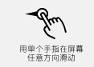 | 滑动触控板&触摸屏以连续滚动列表和页面，切换对象，操作主体在松开的瞬间沿着某个方向还有一定的移动速度，则被控对象沿着该方向继续滑动一段距离, 同时滑动速度逐渐减小, 直到最终停止。 判定手指位移和释放速度满足任意一个即可 |
| 轻扫 | 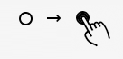 | 手指沿着某个方向移动一段距离，被控对象同时沿着相应的方向移动相应的距离。松开后，被控对象会根据松开时所处的位置、移动速度以及稳定状态之间的界线，共同决定自动回到某个提前规定好的稳定状态 |
| 拖放 |  | 拖动对象移动其位置，例如：移动窗口、移动文件/图标位置、拖动进行批量操作，例如：框选文字等内容、框选图标、刷新页面、滑动以调节滑动条数值 |
| 捏合 | 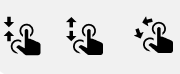 | 两个手指按住触控板&触摸屏向外展开以放大内容，向内收拢以缩小内容，例如：网页、图片 |
| 多点旋转 | 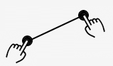 | 当双指都触碰到触控板&触摸屏后, 两个触点之间连线的角度被用来控制诸如照片, 地图等被控对象的旋转角度 |
	 	
	 	
## 单击与长按规则
单击：快速点击，时间小于等于600ms，松开后，执行点击行为
长按：按下，持续时间大于等于600ms，松开后，执行长按行为。注意，单击与长按行为互不干扰，执行长按操作时不执行其操作时间内的单击行为。

## 双击文件重命名
双击重命名文件，实则为两次单击触发重命名，若在<400ms（双击默认值）内完成双击操作，则判定为双击事件。若在400ms外完成第二次点击，则判定为两次单击操作。

## 自定义手势
|	| 图示 |	|功能描述 |
| --- | --- | --- | --- |
| 单指向上轻扫 |		| 触摸屏    | 打开多任务视图   绝对控制，手指释放后稳定化 |
| 单指向下轻扫 |		| 触摸屏	| 显示桌面   相对控制，手指释放后稳定化 |
| 单指屏幕右侧向左轻扫 |		| 触摸屏 | 呼出侧边栏   绝对控制 |
| 双指左右滑动| 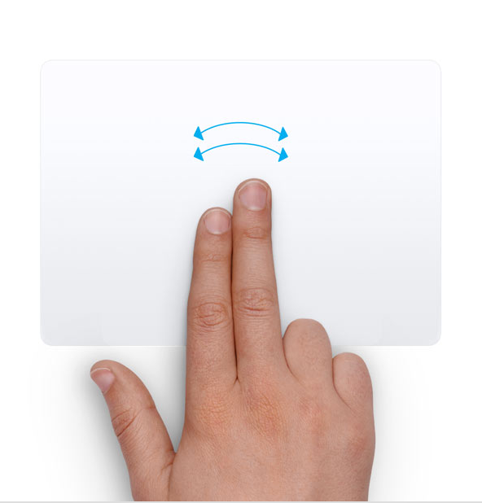	| 触控板   触摸屏| 	调节滑动条，亮度&音量 |
| 三指上下轻扫| 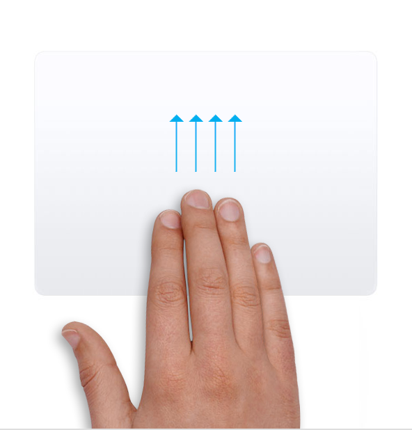	| 触控板 | 	· 打开多任务视图&关闭多任务视图    ·显示桌面&显示打开的应用   相对控制，手指释放后稳定化|
| 三指左右轻扫| 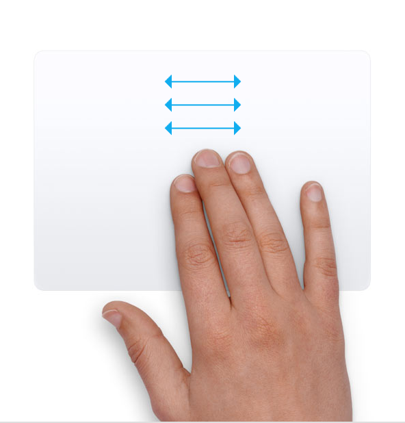	| 触控板 | 	切换应用窗口    绝对控制，手指释放后稳定化 |
| 三指点击| 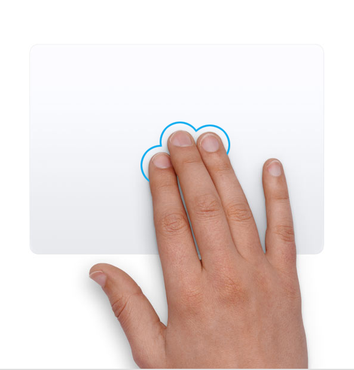	| 触控板 | 	唤起全局搜索&关闭全局搜索 |
| 四指点击| 	| 触控板 | 	呼出侧边栏&关闭侧边栏 |
| 四指左右轻扫| 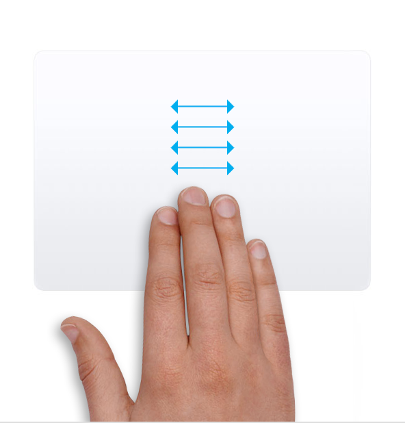	| 触控板   触摸屏 | 	切换虚拟桌面   相对控制，手指释放后稳定化 |
| 四指任意位置向下滑动| 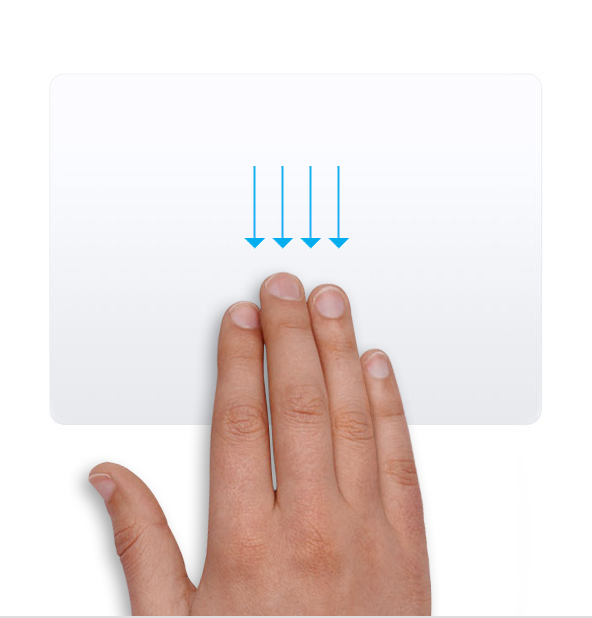	| 触控板 | 	唤起全局搜索 |

## 控制方式：
1. 相对控制：手势仅控制页面是否出现，手指与被控对象位置无对应关系。
2. 绝对控制：手指的移动速度和位置变化和视图的位置变化是对应的。
3. 稳定化：稳定化效果：当我们使用手势控制某个受控物时，由于手势的某个属性（如手指位移）达到阈值，进而导致受控物的某个属性稳定在了特定状态的效果被称为「稳定化效果」，或者也可以称为「吸附」。稳定化效果能够保持界面的视觉秩序，避免过多的中间状态导致界面的杂乱，进而帮助用户聚焦信息。是否有稳定化效果是区别轻扫与另外两个手势即滑动和拖拽的重要维度，当某个位移类手势有稳定化效果，我们就将其称作轻扫。

## 触摸屏接触点样式
|	| 图示	| 规范 |
| --- | --- | --- |
| 单指点击：  只显示内圈	 |  |	内圈直径：48px   颜色：#E5EFF7，透明度：85% |
| 单指长按：  进度条转动，内外圈同时出现	 |  |	内圈直径：80px   内圈颜色：#E5EFF7，透明度：65%   外圈颜色：#236CDA，透明度：85%   描边：8px |
| 单击拖动状态：  只显示拖尾	 |  |	颜色：#E0E7F1   透明度：从左至右50%渐变至100%   高度：5px |
