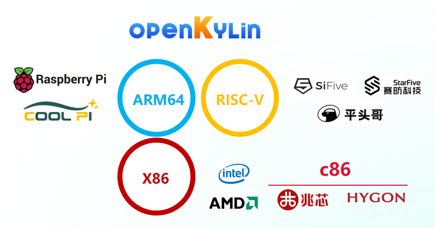
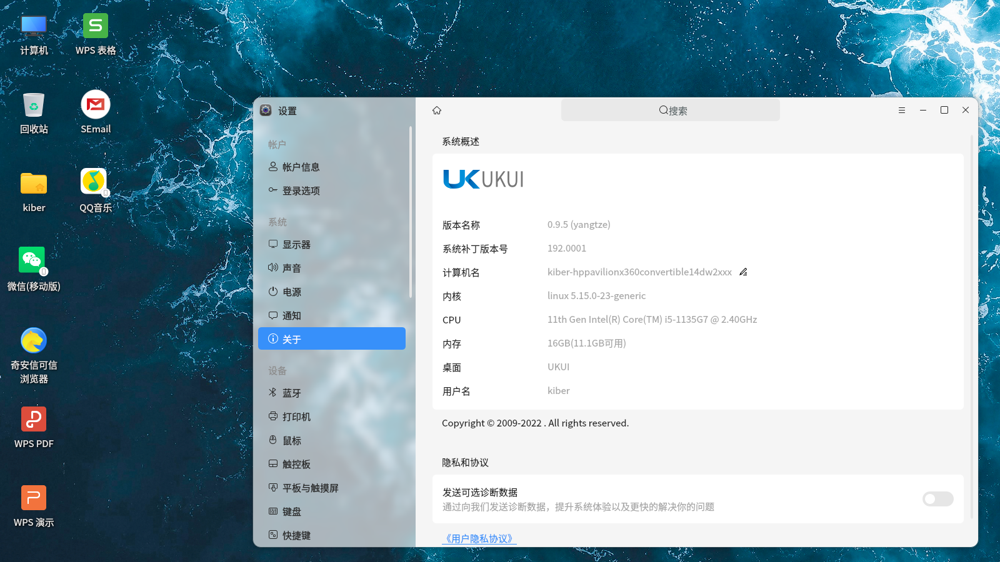
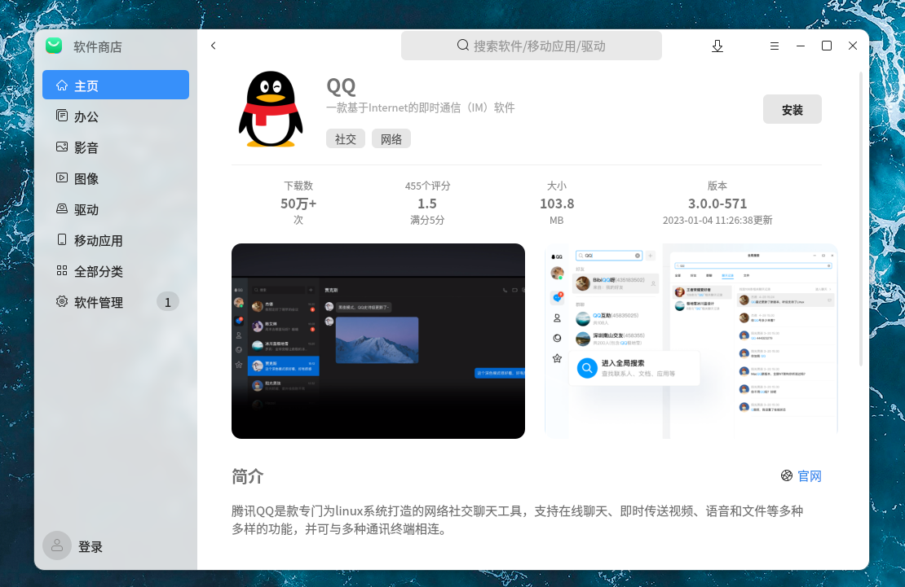
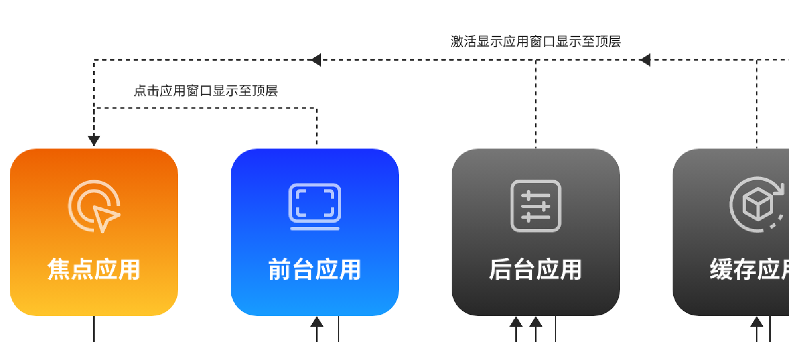
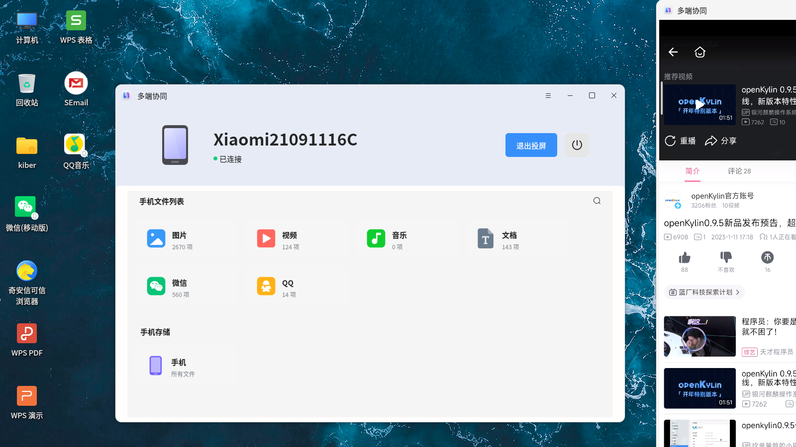
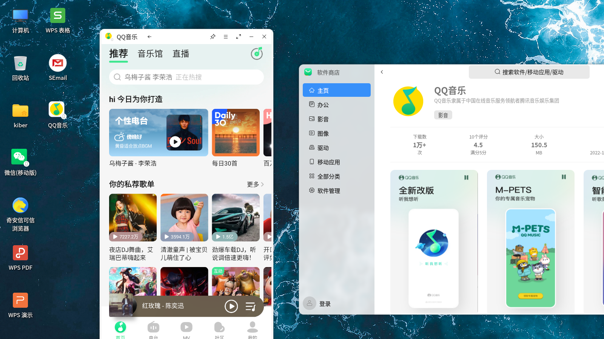
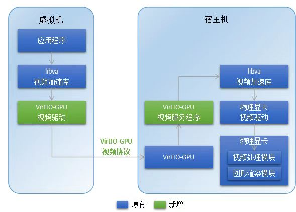
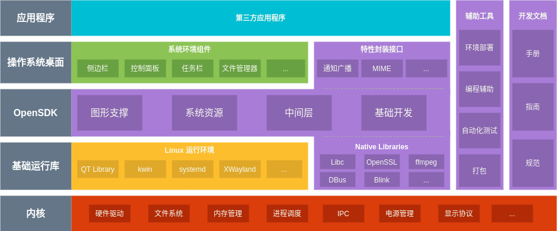
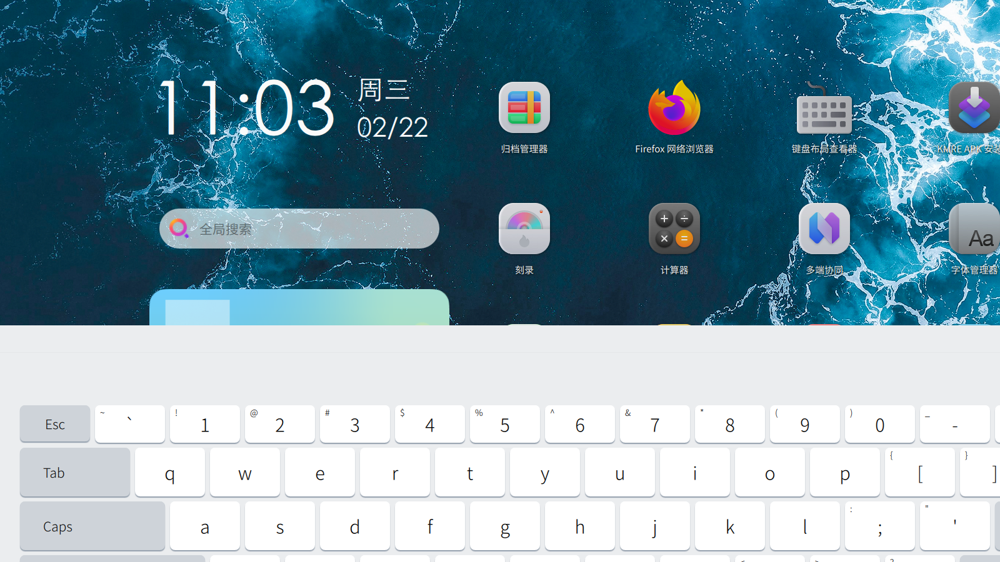

# openKylin开源操作系统
openKylin操作系统是由openKylin社区主导开发的一款根社区桌面操作系统，适用于X86、ARM、RISC-V等主流架构的台式电脑、笔记本电脑、平板和嵌⼊式设备。在内核、基础库、应用软件等方面均采用领先的版本，是麒麟商业版本的技术上游，与商业版本路线一致、协同发展。同时，openKylin社区版还将融合各类创新技术应用，汇聚行业力量，共同推动Linux行业创新发展！

## 版本特性
openKylin操作系统当前处于1.0版本开发阶段，截止2023年3月，已累计发布0.7、0.7.5、0.9和0.9.5四个阶段性版本，融入了来自openKylin社区20多个SIG组贡献的新特性和新需求，官网累计镜像下载量超过75万次。

## 多架构支持
openKylin操作系统目前适配支持X86、ARM、RISC-V三个架构的个人电脑、笔记本电脑和平板设备，其中ARM架构完成了Raspberry Pi、COOL Pi开发板的适配，RISC-V架构完成了Hifive unmatched、赛昉VisionFive、阿里平头哥曳影1520的适配。可以满足绝大多数个人用户及开发者的使用需求！

## UKUI 4.0桌面环境
默认搭载全新一代的UKUI 4.0桌面环境，深度优化了平板体验，包括平板模式的桌面、时间日期小插件、文件管理器、侧边栏、通知中心、天气、工具箱、看图、录音等自研应用的平板模式界面及交互操作展示等桌面环境内容。

## 丰富的应用生态
除影音、音乐、管家等多款自研应用外，openKylin软件商店还为用户提供wps、微信、QQ、酷狗音乐等上千款三方主流软件，满足了用户日常办公、生活娱乐、互联网访问、生产活动等多场景应用需求。

## 分级冻结机制
“分级冻结”是openKylin社区专门设计和开发的一套应用进程生命周期管理机制，针对处于不同状态的应用进行“分级”处理，以某种特殊方式“冻结”用户未操作应用，释放系统资源（如CPU、磁盘I/O、内存等），优先保障用户当前操作应用的资源分配，大幅提升用户体验！

## 互联互通
openKylin操作系统默认预装多端协同工具，支持Android设备与系统设备、系统设备与系统设备之间的便捷互联，共享屏幕、文件同步管理、跨端搜索文件等功能，为openKylin操作系统增加了互联互通能力！

## KMRE移动兼容运行环境
openKylin操作系统支持KMRE移动兼容运行环境，可以实现AA（Android+ARM）生态体系在openKylin操作系统中的兼容运行！

## VirtIO-GPU硬件视频加速
VirtIO-GPU是一项GPU虚拟化技术，但是由于该技术不支持硬件编解码，在虚拟机中播放高清视频时CPU占用率过高，会导致视频卡顿、掉帧等问题。为此，openKylin社区虚拟化SIG组开创性地为VirtIO-GPU开发了一套采用前后端架构的硬件视频加速机制的硬件编解码功能，大幅提升了虚拟机场景下的使用体验！

## openKylin自研开发者套件
openKylin自研开发者套件（以下简称 OpenSDK）致力于在 openKylin 操作系统上，为生态建设与软件开发提供安全、可靠、快捷、稳定的开发者接口。OpenSDK 当前聚焦三大模块，包括应用支撑 SDK、系统能力 SDK、基础开发 SDK，同时充分考虑 OpenSDK 的兼容性。当前OpenSDK SIG组已完成OpenSDK V2.0的开发，为社区开发者提供更安全、更可靠、更快捷、更稳定的开发接口，大幅提升开发效率！

## openKylin虚拟键盘
openKylin虚拟键盘是由InputMethod SIG组主导开发的一款在平板模式下好用、易用、稳定的虚拟键盘。开发期间InputMethod SIG组还与Fcitx5作者深入合作，为Fcitx5输入法框架增加了基本的虚拟键盘支持机制！

