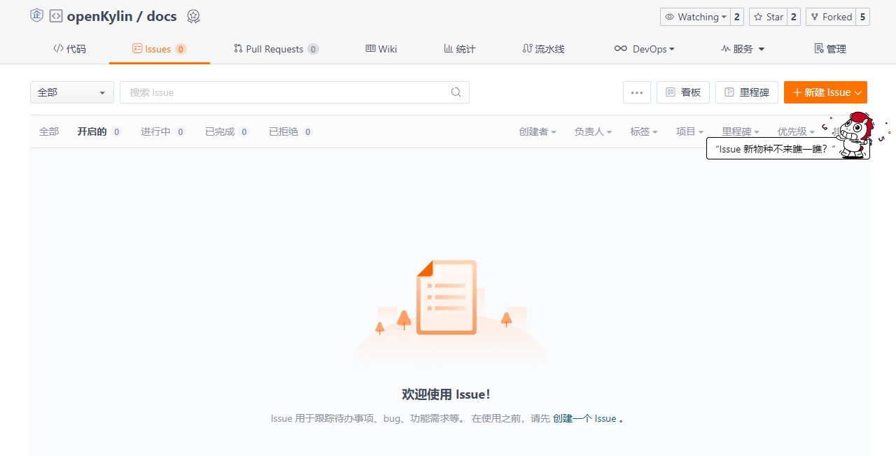
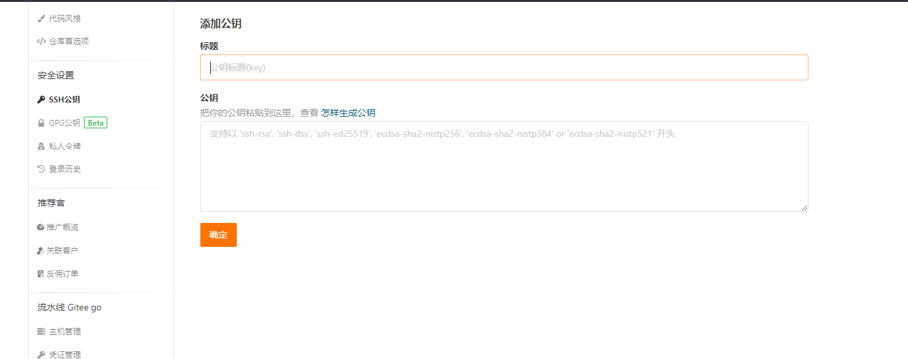
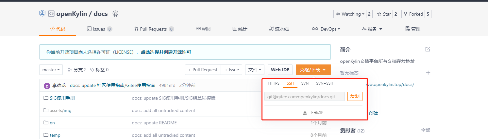
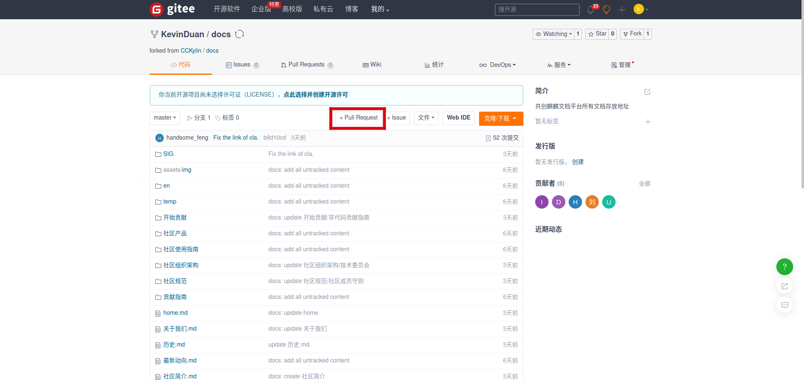

# Gitee使用指南

openKylin社区的参与者可以使用Gitee来参与到优麒麟社区项目中，通过提交BUG/Issue、获取项目、提交推送这几个角度来简单介绍如何使用Gitee。

## 通过GItee提交BUG/Issue

在openKylin社区项目使用过程中有体验不佳、使用存在BUG的情况时，通过Gitee的Issue功能向相关的项目提交你的问题。

点击新建Issue并在描述里添加该问题的详细描述，包括ISO版本、复现手法、复现步骤等信息，提交Issue请遵守《Issue报告规范》，完成相关信息填写后点击创建。完成这一过程即向优麒麟社区项目提交一次Issue。

## 通过Gitee获取项目

在Gitee上注册账号并登录后，用户可以选择先上传自己的SSH公钥，和仓库"只读"权限的 SSH Key 相比，账户的 SSH Key 同时具备推送/拉取的权限，对用户创建/参与的仓库均能使用，使用起来更加方便。
通过选择用户头像 -> 菜单“修改资料”，然后选择“SSH公钥”，填写一个便于识别的标题，然后输入用户的SSH公钥，没有SSH公钥的用户可以通过以下步骤添加公钥。
Linux操作系统或Mac操作系统用户可以打开终端输入：

> $ ssh-keygen -t rsa -C “*youremail@youremail.com*”

生成属于你的密钥，再使用命令:

> $ cat ~/.ssh/id_rsa.pub

在终端输出你的密钥，将其复制到：

即可。Windows操作系统用户打开Git Bash，在控制台中输入以下命令:

> $ ssh-keygen -t rsa -C “*youremail@youremail.com*”

在完成密码输入后 [c盘>用户>自己的用户名>.ssh] 目录下公钥已经生成，将id_rsa.pub文件输出后拷贝到指定位置即可。
在设置完SSH后可以直接使用，进入想要参与的openKylin项目页面中，点击克隆，并在选中SSH后点击复制：

进入系统后视用户操作系统情况打开终端或控制台，输入:

> $ git clone <粘贴内容>

回车即可获取项目源码。
没有添加SSH密钥的用户可以直接使用HTTPS链接进行复制：
进入系统后视用户操作系统情况打开终端或控制台，输入:

> $git clone <粘贴内容> 

即可获取项目源码。

## 通过Gitee向项目提交推送

openKylin社区项目的参与者众多，提交代码请参考遵守《代码合并与提交》。
如果需要向openKylin社区项目提供代码，首先应当fork该项目，建立自己的Gitee仓库。

在合理的修改代码并上传到自己的的仓库后，点击 + Pull Requests 开始提交你的修改pr。

请注意提交时的分支是否正确，确认无误后进入提交界面。补充好这次提交的相关信息后，点击创建，恭喜你，完成了一次向openKylin的贡献。

以上就是Gitee基本使用，欢迎各位向openKylin贡献力量，本指南也在持续更新中...
