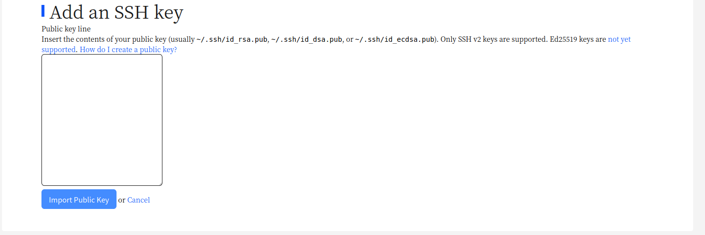
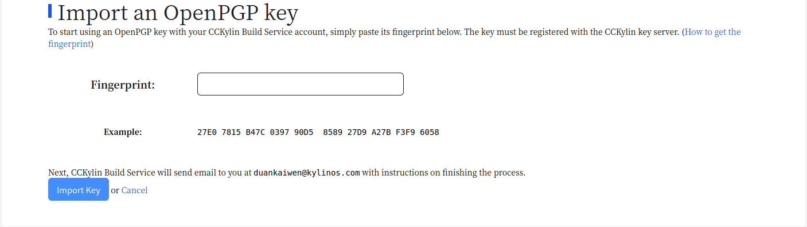

# OKBS软件包编译平台使用说明

## 访问地址

https://build.openkylin.top/ 新用户请注册个人账户,请注意邮箱前缀会成为用户个人ID

## 开发前准备

### 登录和创建ppa

访问个人主页 (https://build.openkylin.top/~)，在“Personal package archives”区域点击“Create a new PPA”链接，按提示填写表单，然后点击“Activate”

### 添加ssh公钥

使用命令

> $ ssh-keygen -t rsa

创建ssh密钥,并视情况使用命令

> $ cat ~/.ssh/id_rsa.pub

将输出复制至图片所在位置

点击 Import Public Key 上传即可

### 添加PGP公钥

创建公钥命令

> $ gpg --full-gen-key

根据提示补充相关信息,默认将会选择RSA类型,3072位长度且永不过期

并请填写姓名和常用邮箱

创建完成后使用命令

> $ gpg --fingerprint

可以查看当前系统中密钥

将密钥上传到 hkp://keyserver.build.openkylin.top:11371 执行命令

> $ gpg --keyserver hkp://keyserver.build.openkylin.top:11371 --send-keys <keyid 后8位即可>

上传后将创建密钥拷贝到图片所在位置

点击 import key 即可

### 配置dput工具

修改本地 ~/.dput.cf 或 /etc/dput.cf ，添加如下内容：

LOGIN改为自己的okbs帐号对应ID

> [okbs] 

> fqdn=upload.build.openkylin.top:2121 

> method=sftp 

> incoming=%(okbs)s 

> login=LOGIN 

## 上传源码包到 ppa

源码包 changelog 中，系列代号设置为 yangtze

在执行 dput 前请保证系统环境中安装了 paramiko

> $ sudo pip3 install paramiko

使用该命令安装依赖

生成source.changes后，按照ppa页面的提示执行dput命令

例如： 

> $ dput okbs:~xiewei/ppa <source.changes> 

dput执行成功后，需要等待服务器处理上传的文件，可在 http://archive.build.openkylin.top/dput-logs/ 查看处理结果。

## 上传源码包到openKylin

新源码包请先向技术委员会发出申请 ,具体请看[SIG组的成员与维护包变更流程](/zh/SIG使用手册/SIG组的成员与维护包变更流程)

在确认获取相应权限后再上传openkylin相关ppa

> $ dput okbs:openkylin <source.changes> 
