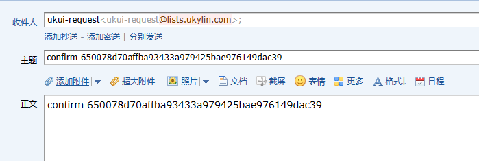

# 邮件列表使用指南

## 邮件列表介绍
- 访问地址：<a target="blank" href="https://mailweb.openkylin.top/postorius/lists/">mailweb.openkylin.top</a>
- 邮件组介绍：每个邮件组都会专门的邮箱管理该邮件组，以**UKUI**为例，如下所示
	ukui@lists.openkylin.top (邮件组邮箱地址)
  ukui-request@lists.openkylin.top(邮件组订阅邮箱地址)
	ukui-owner@lists.openkylin.top(邮件组管理员邮箱地址)

## 如何订阅 SIG 组
1. 进入[邮件列表主页](https://mailweb.openkylin.top/postorius/lists/)后，如下图，点击进入想要订阅的 SIG 组。
---

---

2. 进入对应的邮件组后，如下图所示，在输入框填入邮件地址以及名字，点击下方Subscribe按钮，即可收到订阅SIG的确认邮件。

---

---

3. 订阅邮箱会接收到确认加入信息，按照提示输入验证信息即可加入对应的SIG组。

4. 如果订阅成功，则会收到来自邮件组的欢迎信，如下图所示。

---

---

注：如果以上步骤均正常，但是没有收到邮件，请联系 contact@openkylin.top 该邮箱说明一下情况

## 如何取消订阅 SIG 组
1. 以**UKUI**组为例，发送邮件到ukui-request@list.openkylin.top, 该邮件的内容主题和正文包含“**unsubscribe**”即可，具体如下图所示
---

---

2. 接下来则会收到退订验证邮件，具体如下图

---

---

3. 按照提示的信息，回信的时候携带验证信息，并用作于邮件的**主题**以及**正文**，即可完成对该SIG组的订阅，具体如下图所示。

---

---

4. SIG 组验证成功后，便已经取消订阅该 SIG 组

## 如何向 SIG 组成员发送邮件

任何成员都可以向SIG组的所有成员发送邮件，邮件地址为SIG组的地址，以UKUI为例，邮件地址就为 ukui@lists.openkylin.top。

